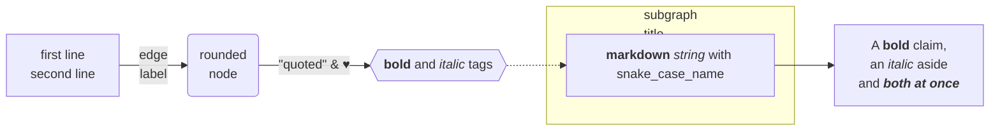
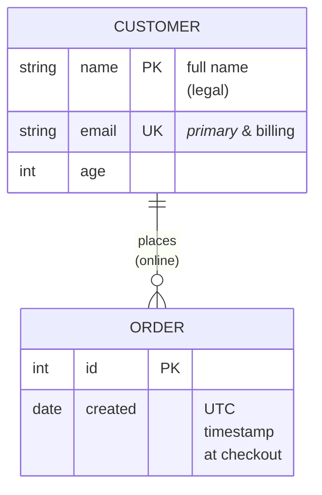
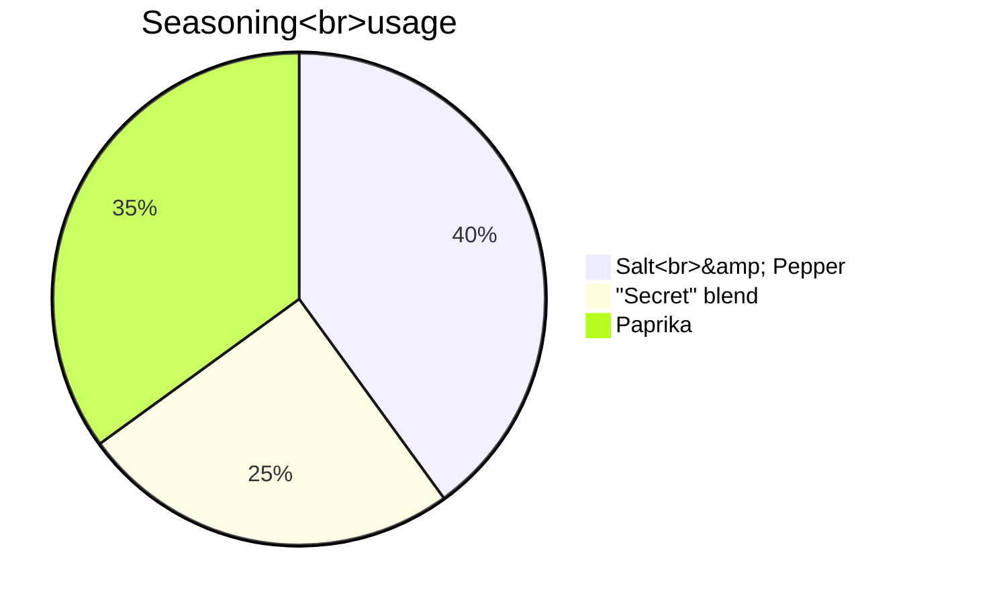
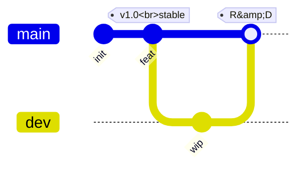
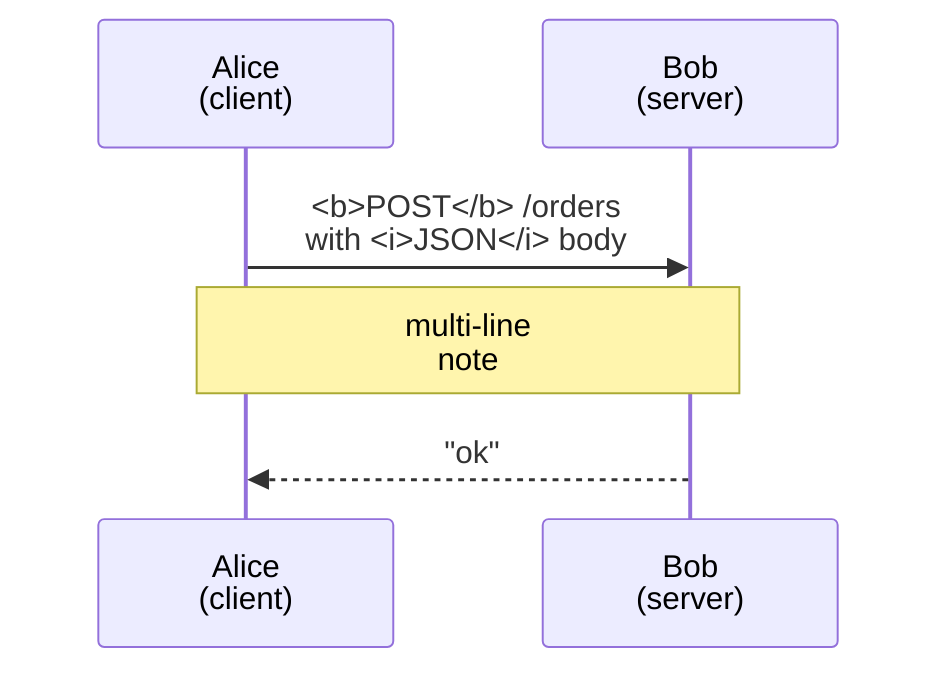
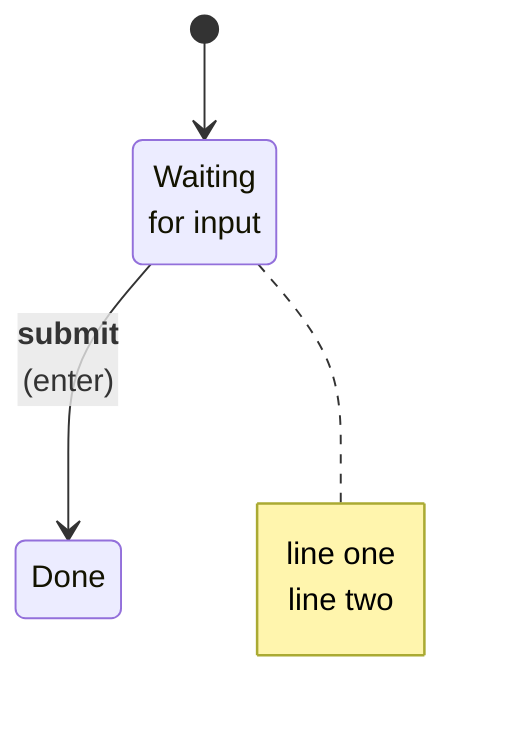

# Label markup

Line breaks (` `, ` `, ` `), HTML tags, entity codes and
markdown strings in labels, across several diagram types.

```mermaid
flowchart LR
  A["first line<br>second line"] -- "edge<br/>label" --> B(rounded<br />node)
  B -->|"#quot;quoted#quot; &amp; #9829;"| C{{"<b>bold</b> and <i>italic</i> tags"}}
  C -.-> D["`**markdown** *string* with snake_case_name`"]
  D --> E["`A **bold** claim,
  an *italic* aside
  and ***both at once***`"]
  subgraph S [subgraph<br>title]
    D
  end
```

```mermaid
erDiagram
  CUSTOMER ||--o{ ORDER : "places<br>(online)"
  CUSTOMER {
    string name PK "full name<br/>(legal)"
    string email UK "<i>primary</i> &amp; billing"
    int age
  }
  ORDER {
    int id PK
    date created "UTC<br>timestamp<br>at checkout"
  }
```

```mermaid
pie title Seasoning<br>usage
  "Salt<br>&amp; Pepper" : 40
  "#quot;Secret#quot; blend" : 25
  "Paprika" : 35
```

```mermaid
gitGraph
  commit id: "init"
  commit id: "feat" tag: "v1.0<br>stable"
  branch dev
  commit id: "wip"
  checkout main
  merge dev tag: "R&amp;D"
```

```mermaid
sequenceDiagram
  participant A as Alice<br>(client)
  participant B as Bob<br>(server)
  A->>B: <b>POST</b> /orders<br/>with <i>JSON</i> body
  Note over A,B: multi-line<br>note
  B-->>A: #quot;ok#quot;
```

```mermaid
stateDiagram-v2
  state "Waiting<br>for input" as W
  [*] --> W
  W --> Done : <b>submit</b><br>(enter)
  note right of W : line one<br>line two
```
