# mergo showcase

Open this file with `mergo examples/showcase.md` and press <kbd>tab</kbd> to flip
through the diagrams.

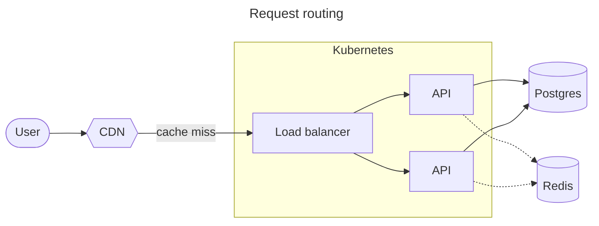
```mermaid
---
title: Request routing
---
flowchart LR
    user([User]) --> cdn{{CDN}}
    cdn -->|cache miss| lb[Load balancer]
    subgraph cluster [Kubernetes]
        direction TB
        lb --> api1[API] & api2[API]
    end
    api1 & api2 --> db[(Postgres)]
    api1 & api2 -.-> cache[(Redis)]
```

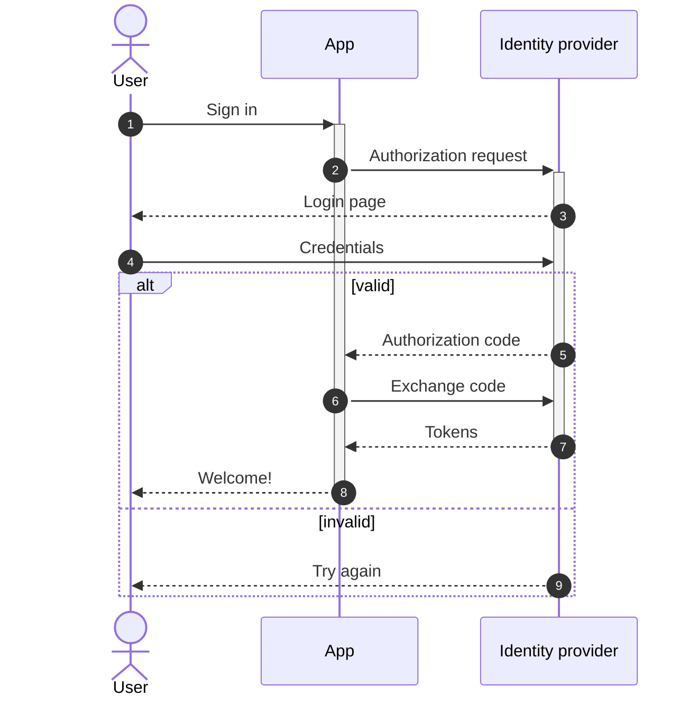
```mermaid
sequenceDiagram
    autonumber
    actor U as User
    participant A as App
    participant I as Identity provider
    U->>+A: Sign in
    A->>+I: Authorization request
    I-->>U: Login page
    U->>I: Credentials
    alt valid
        I-->>A: Authorization code
        A->>I: Exchange code
        I-->>-A: Tokens
        A-->>-U: Welcome!
    else invalid
        I-->>U: Try again
    end
```

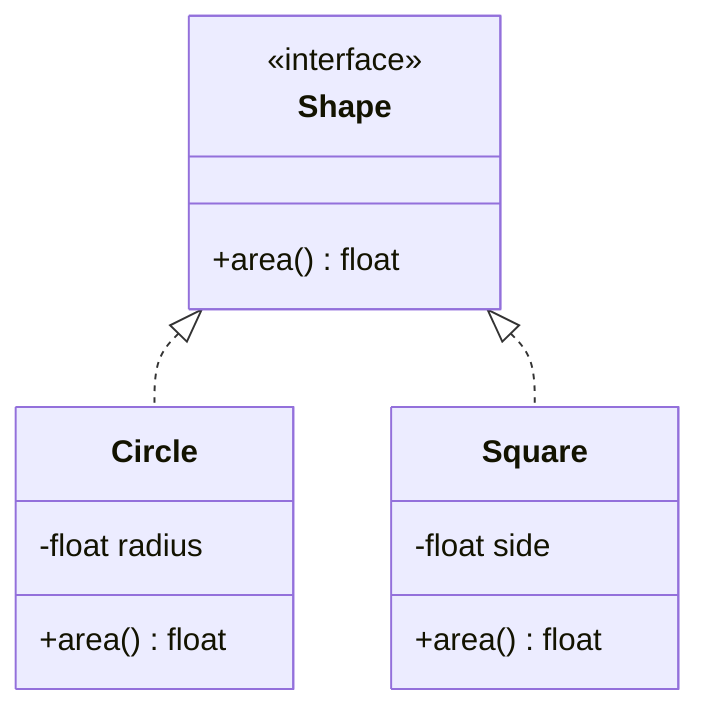
```mermaid
classDiagram
    class Shape {
        <<interface>>
        +area() float
    }
    class Circle {
        -float radius
        +area() float
    }
    class Square {
        -float side
        +area() float
    }
    Shape <|.. Circle
    Shape <|.. Square
```

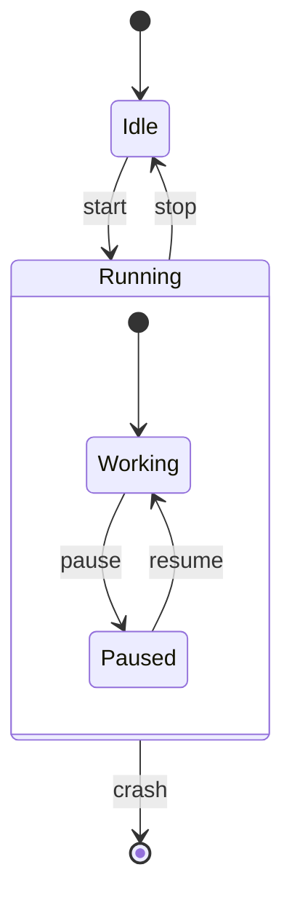
```mermaid
stateDiagram-v2
    [*] --> Idle
    Idle --> Running : start
    state Running {
        [*] --> Working
        Working --> Paused : pause
        Paused --> Working : resume
    }
    Running --> Idle : stop
    Running --> [*] : crash
```

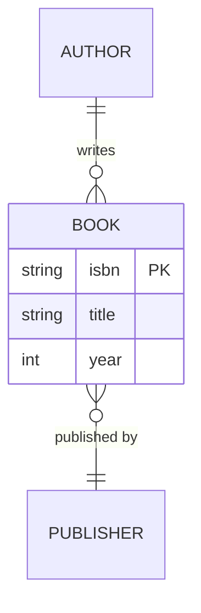
```mermaid
erDiagram
    AUTHOR ||--o{ BOOK : writes
    BOOK }o--|| PUBLISHER : "published by"
    BOOK {
        string isbn PK
        string title
        int year
    }
```

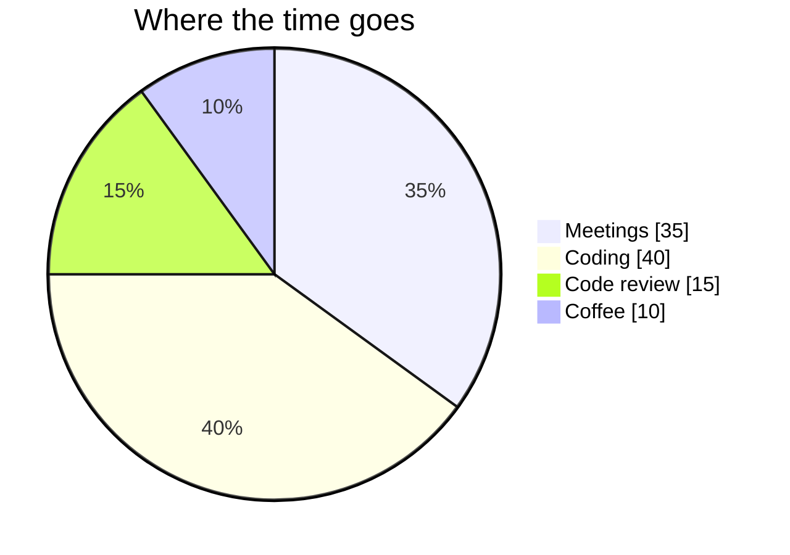
```mermaid
pie showData
    title Where the time goes
    "Meetings" : 35
    "Coding" : 40
    "Code review" : 15
    "Coffee" : 10
```

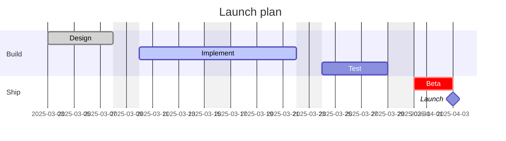
```mermaid
gantt
    title Launch plan
    dateFormat YYYY-MM-DD
    excludes weekends
    section Build
        Design      :done, d1, 2025-03-03, 5d
        Implement   :active, i1, after d1, 10d
        Test        :t1, after i1, 5d
    section Ship
        Beta        :crit, b1, after t1, 3d
        Launch      :milestone, after b1, 0d
```

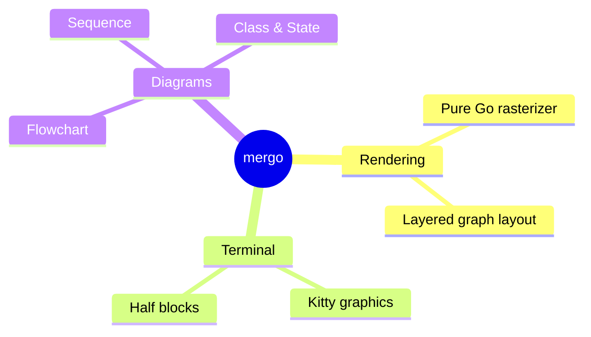
```mermaid
mindmap
  root((mergo))
    Rendering
      Pure Go rasterizer
      Layered graph layout
    Terminal
      Kitty graphics
      Half blocks
    Diagrams
      Flowchart
      Sequence
      Class & State
```

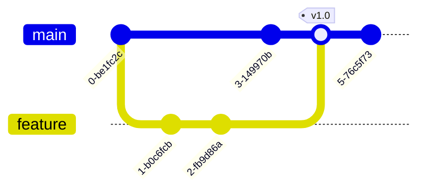
```mermaid
gitGraph
    commit
    branch feature
    commit
    commit
    checkout main
    commit
    merge feature tag: "v1.0"
    commit
```

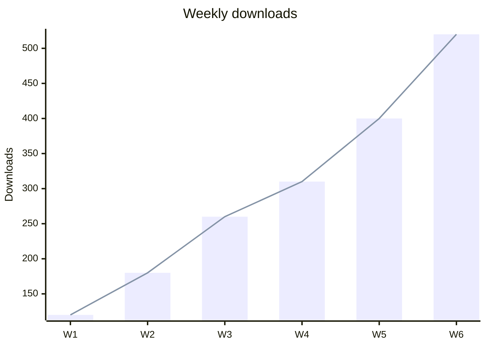
```mermaid
xychart-beta
    title "Weekly downloads"
    x-axis [W1, W2, W3, W4, W5, W6]
    y-axis "Downloads"
    bar [120, 180, 260, 310, 400, 520]
    line [120, 180, 260, 310, 400, 520]
```

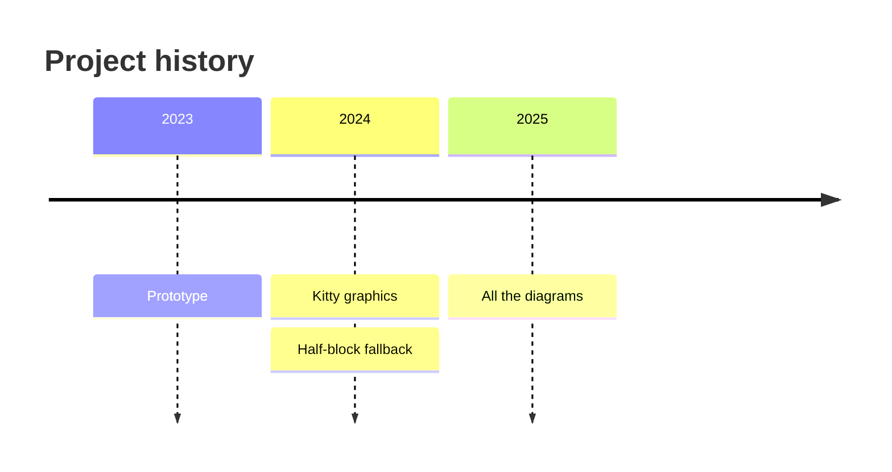
```mermaid
timeline
    title Project history
    2023 : Prototype
    2024 : Kitty graphics : Half-block fallback
    2025 : All the diagrams
```

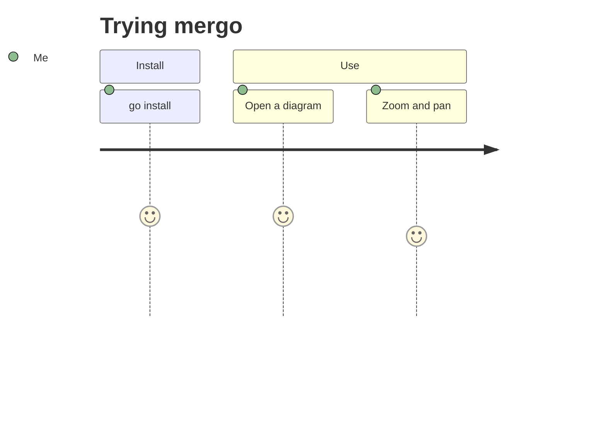
```mermaid
journey
    title Trying mergo
    section Install
      go install: 5: Me
    section Use
      Open a diagram: 5: Me
      Zoom and pan: 4: Me
```

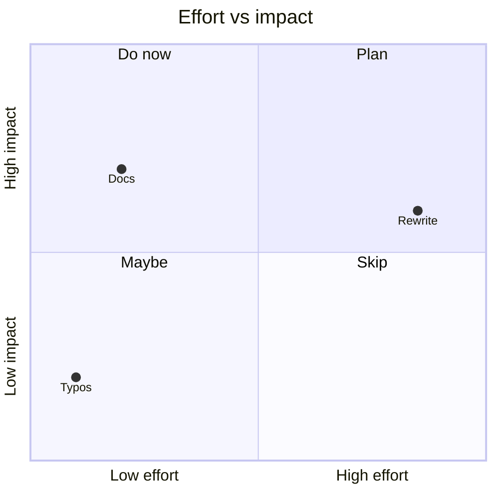
```mermaid
quadrantChart
    title Effort vs impact
    x-axis Low effort --> High effort
    y-axis Low impact --> High impact
    quadrant-1 Plan
    quadrant-2 Do now
    quadrant-3 Maybe
    quadrant-4 Skip
    Docs: [0.2, 0.7]
    Rewrite: [0.85, 0.6]
    Typos: [0.1, 0.2]
```
